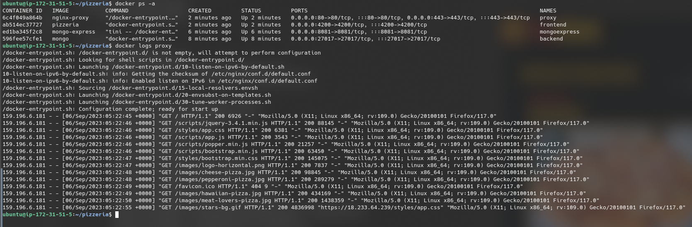
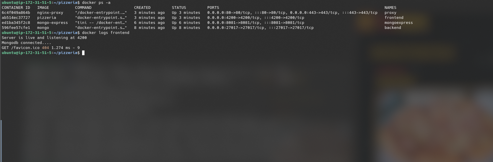
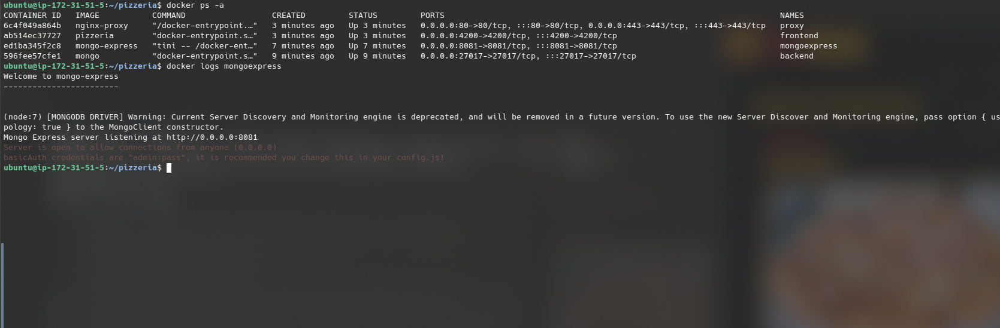
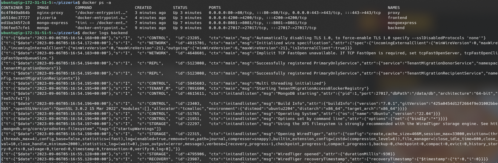

# Instance Setup

- Create the EC2 instance:
    - name: Assignment 1
    - OS Image: Ubuntu Server 22.04 LTS x86_64
    - Instance Type: t2.small
    - Security Configuration: Allow incoming on ports: SSH, HTTP, HTTPS and 8081.
    - Storage Configuration: 32 GiB of gp2 storage.

- Update apt packages and install any updates \
    `$ sudo apt update && sudo apt upgrade`

- Install some packages for later \
    `$ sudo apt install unzip`

## Install Docker Community Edition on the Instance

- Install prerequisite packages \
    `$ sudo apt install apt-transport-https ca-certificates curl software-properties-common`

##### Set up the apt Docker Repository
- Add the GPG key for the official Docker repository \
    `$ curl -fsSL https://download.docker.com/linux/ubuntu/gpg | sudo gpg --dearmor -o /usr/share/keyrings/docker-archive-keyring.gpg`

- Add the Docker repository to apt sources \
    `$ echo "deb [arch=$(dpkg --print-architecture) signed-by=/usr/share/keyrings/docker-archive-keyring.gpg] https://download.docker.com/linux/ubuntu $(lsb_release -cs) stable" | sudo tee /etc/apt/sources.list.d/docker.list > /dev/null`

- Update apt packages again. We just added a new repository (Docker repository) to apt and update needs to be run so packages can be installed from it \
    `$ sudo apt update`

- Ensure docker-ce is now available through apt. This command should mention that docker-ce is available. \
    `$ apt-cache policy docker-ce`

##### Install and set up Docker Community Edition
- Install docker-ce \
    `$ sudo apt install docker-ce`

- Ensure the Docker systemd service is enabled and running. The output of this command should contain "Active: active (running) since ...". \
    `$ sudo systemctl status docker`

- If the service is not enabled or running, enable and run it \
    `$ sudo systemctl enable docker` \
    `$ sudo systemctl start docker`

- Ensure the docker command works \
    `$ docker`

- Add the ubuntu user account to the docker group. `$USER` is an environment variable which holds the username of the current user. You may need to exit the SSH session and rejoin for the change to take effect. \
    `$ sudo usermod -aG docker $USER`

### Download Docker Images

- Download the mongo and mongo-express docker images. The mongo image provides us with the MongoDB database itself and mongo-express provides a gui application for interacting with the database. \
    `$ docker pull mongo` \
    `$ docker pull mongo-express`

### Bridge Network
Docker comes with a default bridge network, but this network does not provide automatic DNS resolution between containers. To do this, we have to create our own bridge network.

What is meant by automatic DNS resolution? We can get the local ipv4 address of a container by addressing it by the container name. For example, `http://backend/` will resolve to `http://aaa.bbb.ccc.ddd/`.

- Create a bridge network for container communication \
    `$ docker network create -d bridge bridge-net`

# Task 1 - Individual Containers

## Pizzeria App (Front-End)

#### Aquire the Application

- Download and unzip the pizzeria app. \
    `$ wget http://formal-analysis.com/tmp/pizzeria.zip` \
    `$ unzip pizzeria.zip`

- Delete the original zip file and the __MACOSX folder. \
    `$ rm pizzeria.zip` \
    `$ rm -R __MACOSX`

- Rename the pizzeria-assignment1 folder to pizzeria. \
    `$ mv pizzeria-assignment1 pizzeria`

#### Build the Docker Image

- Create the Dockerfile \
    `$ cd pizzeria` \
    `$ nano Dockerfile`

        # Use the node docker image as a base for this image.
        FROM node:latest

        WORKDIR /usr/src/app
        COPY package*.json ./

        # Install node.js dependencies (found in package.json).
        RUN npm install

        # Copy all directory contents.
        COPY . .

        # The pizzeria app requires these environment variables to be set.
        ENV MONGODB_URI="mongodb://backend:27017/"
        ENV PORT=4200
        ENV SECRET="secret"

        # Run the app on port 4200.
        EXPOSE 4200

        # Run the app with the command "node server.js".
        CMD ["node", "server.js"]

- Build the docker image, we'll name the image "pizzeria". \
    `$ docker build -t pizzeria .`

## Nginx Proxy

#### SSL Setup

- Make a directory for the nginx image  \
    `$ mkdir nginx-proxy` \
    `$ cd nginx-proxy`

- Generate the root CA private key (.key) and privacy enhanced mail (.pem) files. \
    `$ openssl req -x509 -nodes -new -sha256 -days 1024 -newkey rsa:2048 -keyout RootCA.key -out RootCA.pem -subj "/C=US/CN=My-Root-CA"`

- Generate the root certificate (crt) from the pem file. \
    `$ openssl x509 -outform pem -in RootCA.pem -out RootCA.crt`

- Create the domains.ext file. \
    `$ nano domains.ext`

        authorityKeyIdentifier=keyid, issuer
        basicConstraints=CA:FALSE
        keyUsage = digitalSignature, nonRepudiation, keyEncipherment, dataEncipherment
        subjectAltName = @alt_names
        [alt_names]
        DNS.1 = localhost
        DNS.2 = fake1.local

- Generate the ssl certificate. \
    `$ openssl req -new -nodes -newkey rsa:2048 -keyout localhost.key -out localhost.csr -subj "/C=US/ST=YourState/L=YourCity/O=Example-Certificates/CN=localhost.local"`

- Take the csr to the CA to return a certificate. \
    `$ openssl x509 -req -sha256 -days 1024 -in localhost.csr -CA RootCA.pem -CAkey RootCA.key -CAcreateserial -extfile domains.ext -out localhost.crt`

- Move openssl output to it's own directory to keep the directory neat. \
    `$ mkdir ssl` \
    `$ mv localhost.* ssl/` \
    `$ mv RootCA.* ssl/`

#### Nginx Configuration
- Write the nginx configuration file \
    `$ nano nginx.conf`

        worker_processes 1;

        events {
            worker_connections 1024;
        }

        http {
            sendfile on;
            large_client_header_buffers 4 32k;

            upstream frontend-server {
                server node-frontend:4200;
            }

            server {
                listen 443 ssl;
                server_name localhost;
                ssl_certificate /etc/ssl/certs/localhost.crt;
                ssl_certificate_key /etc/ssl/private/localhost.key;

                location / {
                    proxy_pass http://frontend-server/;
                    proxy_connect_timeout 120s;
                    proxy_send_timeout 120s;
                    proxy_read_timeout 120s;
                    proxy_redirect off;
                    proxy_http_version 1.1;
                    proxy_cache_bypass $http_upgrade;
                    proxy_set_header Upgrade $http_upgrade;
                    proxy_set_header Connection keep-alive;
                    proxy_set_header Host $host;
                    proxy_set_header X-Real-IP $remote_addr;
                    proxy_set_header X-Forwarded-For $proxy_add_x_forwarded_for;
                    proxy_set_header X-Forwarded-Proto $scheme;
                    proxy_set_header X-Forwarded-Host $server_name;
                    proxy_buffer_size 128k;
                    proxy_buffers 4 256k;
                    proxy_busy_buffers_size 256k;
                }
            }
        }

#### Docker Configuration
- Write the Dockerfile. \
    `$ nano Dockerfile`

        # Use the nginx docker image as a base
        FROM nginx

        # Copy the nginx.conf we just wrote to the required location
        COPY nginx.conf /etc/nginx/nginx.conf

        # Copy the SSL cert + key to the required location
        COPY ssl/localhost.crt /etc/ssl/certs/localhost.crt
        COPY ssl/localhost.key /etc/ssl/private/localhost.key

- Build the Docker image. We'll name the image "nginx-proxy". \
    `$ docker build -t nginx-proxy .`

## Start the Docker containers

Now that we have all the images needed, we can run them.
- The `--network` flag is used to specify which docker network to run the containers over.
- We use the `bridge-net` bridge network we created earlier for automatic DNS resolution.

Run the containers in this order, this is required because:
- Both Mongo Express and Nginx will try connecting to the MongoDB backend on startup.
- Nginx will try connecting to the frontend on startup.

1. MongoDB backend: `$ docker run --network=bridge-net --name=backend -p 27017:27017 -d mongo`
    - `-d mongo` -Run a container using the `mongo` image.
    - `--network=bridge-net` -Run the container on the `bridge-net` network.
    - `--name=backend` -Name the container `backend`.
    - `-p 27017:27017` -Map the internal port 27017 to the external port 27017.

2. Mongo Express: `$ docker run --network=bridge-net --name=mongoexpress -e ME_CONFIG_MONGODB_SERVER=backend -p 8081:8081 -d mongo-express`
    - `-d mongo-express` -Run a container using the `mongo-express` image.
    - `--network=bridge-net` -Run the container on the `bridge-net` network.
    - `--name=mongoexpress` -Name the container `mongoexpress`.
    - `-p 8081:8081` -Map the internal port 8081 to the external port 8081.
    - `-e ME_CONFIG_MONGODB_SERVER=backend` -Set the environment variable `ME_CONFIG_MONGODB_SERVER` to `backend`. This environment holds the address used to connect to the MongoDB database.

3. Pizzeria frontend: `$ docker run --network=bridge-net --name=frontend -p 4200:4200 -d pizzeria`
    - `-d pizzeria` -Run a container using the `pizzeria` image.
    - `--network=bridge-net` -Run the container on the `bridge-net` network.
    - `--name=frontend` -Name the container `frontend`.
    - `-p 4200:4200` -Map the internal port 4200 to the external port 4200.

4. Nginx proxy: `$ docker run --network=bridge-net --name=proxy -p 80:80 -p 443:443 -d nginx-proxy`
    - `-d nginx-proxy` -Run a container using the `nginx-proxy` image.
    - `--network=bridge-net` -Run the container on the `bridge-net` network.
    - `--name=proxy` -Name the container `proxy`.
    - `-p 443:443` -Map the internal port 443 (HTTPS) to the external port 443.

The Pizzeria application should now be accessible over HTTPS and the Mongo Express gui over HTTP on port 8081.

#### Nginx Proxy logs

#### Pizzeria (frontend) logs

#### Mongo Express logs

#### MongoDB (backend) logs

# Task 3 - Minikube and Kubectl

- Ensure instance has at least 2 CPU cores.
    - Stop the instance
    - Go to actions > instance settings > change instance type
    - Select t2.medium
    - Start the instance

## Install Minikube
- Install Minikube. \
    `$ curl -LO https://storage.googleapis.com/minikube/releases/latest/minikube-linux-amd64` \
    `$ sudo install minikube-linux-amd64 /usr/local/bin/minikube` \

- Create alias for kubectl. \
    `$ alias kubectl="minikube kubectl --"`

- Deleted downloaded file after install. \
    `$ rm -R minikube-linux-amd64`

- Start Minikube. \
    `$ minikube start` \
    `$ minikube status`

- List pods running in the cluster. \
    `$ kubectl get pods -A`

## Minikube + Docker
- Configure the local environment variables to run docker inside the Minikube container. \
    `$ eval $(minikube docker-env)`

- List the docker images. \
    `$ docker images`
    

## Pizzeria (frontend)
- Navigate to the pizzeria project directory and build the frontend docker image from task 1. \
    `$ cd pizzeria` \
    `$ docker build -t frontend .`

#### Create a deployment for MongoDB
- Create a mongo-deployment.yml file. \
  `$ nano mongo-deployment.yml`

      apiVersion: apps/v1
      kind: Deployment
      metadata:
        name: mongo-deployment
        labels:
          app: mongo
      spec:
        replicas: 1
        selector:
          matchLabels:
            app: mongo
        template:
          metadata:
            labels:
              app: mongo
          spec:
            containers:
            - name: backend
              image: mongo
              ports:
              - containerPort: 27017

- Apply the deployment. \
  `$ kubectl apply -f mongo-deployment.yml`

#### Create a service for MongoDB
- Create a mongo-service.yml file. \
  `$ nano mongo-service.yml`

      apiVersion: v1
      kind: Service
      metadata:
        name: mongo-service
      spec:
        selector:
          app: mongo
        ports:
          - protocol: TCP
            port: 27017
            targetPort: 27017

- Apply the service. \
  `$ kubectl apply -f mongo-service.yml`

#### Create a pod for the Pizzeria app
Like in task 1, the pizzeria app requires some environment variables to be defined.
- Go back to the parent directory and create a pizzeria-pod.yml file. \
    `$ cd ..` \
    `$ nano pizzeria-pod.yml`

      apiVersion: v1
      kind: Pod
      metadata:
        name: pizzeria-pod
        labels:
          app: pizzeria
      spec:
        containers:
          - name: frontend
            imagePullPolicy: Never
            image: frontend
            env:
            - name: MONGODB_URI
              value: "mongodb://backend:27017/"
            - name: PORT
              value: "4200"
            - name: SECRET
              value: "secret"

- Create the pod. \
  `$ kubectl apply -f pizzeria-pod.yml`

- Verify the pod status. \
  `$ kubectl get pods` \
  

- Check logs to ensure nothing went wrong. \
  `$ kubectl logs pizzeria-pod` \
  

#### Create a deployment for the Pizzeria app

- Create a pizzeria-deployment.yml file. \
  `$ nano pizzeria-deployment.yml`

      apiVersion: apps/v1
      kind: Deployment
      metadata:
        name: pizzeria-deployment
        labels:
          app: pizzeria
      spec:
        replicas: 1
        selector:
          matchLabels:
            app: pizzeria
        template:
          metadata:
            labels:
              app: pizzeria
          spec:
            containers:
            - name: frontend
              image: pizzeria
              imagePullPolicy: Never
              ports:
              - containerPort: 4200

- Run the deployment. \
  `$ kubectl apply -f pizzeria-deployment.yml`

#### Create a service for the Pizzeria app
- Create a pizzeria-service.yml file. \
  `$ nano pizzeria-service.yml`

      apiVersion: v1
      kind: Service
      metadata:
        name: pizzeria-service
      spec:
        type: LoadBalancer
        selector:
          app: pizzeria
        ports:
          - protocol: TCP
            port: 4200
            targetPort: 4200
            nodePort: 32000

- Apply the service. \
  `$ kubectl apply -f pizzeria-service.yml`

#### Create a pod for the nginx proxy
- Create a proxy-pod.yml file. \
  `$ nano proxy-pod.yml`

      apiVersion: v1
      kind: Pod
      metadata:
        name: proxy-pod
        labels:
          app: proxy
      spec:
        containers:
          - name: proxy
            imagePullPolicy: Never
            image: nginx-proxy

- Apply the pod. \
  `$ kubectl apply -f proxy-pod.yml`

#### Create a deployment for the nginx proxy
- Create a proxy-deployment.yml file. \
  `$ nano proxy-deployment.yml`

      apiVersion: apps/v1
      kind: Deployment
      metadata:
        name: proxy-deployment
        labels:
          app: proxy
      spec:
        replicas: 1
        selector:
          matchLabels:
            app: proxy
        template:
          metadata:
            labels:
              app: proxy
          spec:
            containers:
            - name: proxy
              image: nginx-proxy
              imagePullPolicy: Never
              ports:
              - containerPort: 80

- Apply the deployment. \
  `$ kubectl apply -f proxy-deployment.yml`

#### Create a service for the nginx proxy
- Create a proxy-service.yml file. \
  `$ nano proxy-service.yml`

      apiVersion: v1
      kind: Service
      metadata:
        name: proxy-service
      spec:
        type: LoadBalancer
        selector:
          app: proxy
        ports:
          - protocol: TCP
            port: 80
            targetPort: 443
            nodePort: 32001

- Apply the service. \
  `$ kubectl apply -f proxy-service.yml`

#### Expose the app
- Run this. \
  `$ kubectl port-forward svc/proxy-service 443:443 --address 0.0.0.0 &`
