# Task 1 - Individual Containers

### Bridge Network
Docker comes with a default bridge network, but this network does not provide automatic DNS resolution between containers. To do this, we have to create our own bridge network.

What is meant by automatic DNS resolution? We can get the local ipv4 address of a container by addressing it by the container name. For example, `http://backend/` will resolve to `http://aaa.bbb.ccc.ddd/`.

- Create a bridge network for container communication \
    `$ docker network create -d bridge bridge-net`

## Pizzeria App (Front-End)

#### Aquire the Application

- Download and unzip the pizzeria app. \
    `$ wget http://formal-analysis.com/tmp/pizzeria.zip` \
    `$ unzip pizzeria.zip`

#### Build the Docker Image

- Create the Dockerfile \
    `$ cd pizzeria` \
    `$ nano Dockerfile`

      # Use the node docker image as a base for this image.
      FROM node:latest

      WORKDIR /usr/src/app
      COPY package*.json ./

      # Install node.js dependencies (found in package.json).
      RUN npm install

      # Copy all directory contents.
      COPY . .

      # The pizzeria app requires these environment variables to be set.
      ENV MONGODB_URI="mongodb://backend:27017/"
      ENV PORT=4200
      ENV SECRET="secret"

      # Run the app on port 4200.
      EXPOSE 4200

      # Run the app with the command "node server.js".
      CMD ["node", "server.js"]

- Build the docker image, we'll name the image "pizzeria". \
    `$ docker build -t pizzeria .`

## Nginx Proxy

#### SSL Setup

- Make a directory for the nginx image  \
    `$ mkdir nginx-proxy` \
    `$ cd nginx-proxy`

- Generate the root CA private key (.key) and privacy enhanced mail (.pem) files. \
    `$ openssl req -x509 -nodes -new -sha256 -days 1024 -newkey rsa:2048 -keyout RootCA.key -out RootCA.pem -subj "/C=US/CN=My-Root-CA"`

- Generate the root certificate (crt) from the pem file. \
    `$ openssl x509 -outform pem -in RootCA.pem -out RootCA.crt`

- Create the domains.ext file. \
    `$ nano domains.ext`

      authorityKeyIdentifier=keyid, issuer
      basicConstraints=CA:FALSE
      keyUsage = digitalSignature, nonRepudiation, keyEncipherment, dataEncipherment
      subjectAltName = @alt_names
      [alt_names]
      DNS.1 = localhost

- Generate the ssl certificate. \
    `$ openssl req -new -nodes -newkey rsa:2048 -keyout localhost.key -out localhost.csr -subj "/C=US/ST=YourState/L=YourCity/O=Example-Certificates/CN=localhost.local"`

- Take the csr to the CA to return a certificate. \
    `$ openssl x509 -req -sha256 -days 1024 -in localhost.csr -CA RootCA.pem -CAkey RootCA.key -CAcreateserial -extfile domains.ext -out localhost.crt`

- Move openssl output to it's own directory to keep the directory neat. \
    `$ mkdir ssl` \
    `$ mv localhost.* ssl/` \
    `$ mv RootCA.* ssl/`

#### Nginx Configuration
- Write the nginx configuration file \
    `$ nano nginx.conf`

      worker_processes 1;

      events {
          worker_connections 1024;
      }

      http {
          sendfile on;
          large_client_header_buffers 4 32k;

          upstream frontend-server {
              server frontend:4200;
          }

          server {
              listen 443 ssl;
              server_name localhost;
              ssl_certificate /etc/ssl/certs/localhost.crt;
              ssl_certificate_key /etc/ssl/private/localhost.key;

              location / {
                  proxy_pass http://frontend-server/;
                  proxy_connect_timeout 120s;
                  proxy_send_timeout 120s;
                  proxy_read_timeout 120s;
                  proxy_redirect off;
                  proxy_http_version 1.1;
                  proxy_cache_bypass $http_upgrade;
                  proxy_set_header Upgrade $http_upgrade;
                  proxy_set_header Connection keep-alive;
                  proxy_set_header Host $host;
                  proxy_set_header X-Real-IP $remote_addr;
                  proxy_set_header X-Forwarded-For $proxy_add_x_forwarded_for;
                  proxy_set_header X-Forwarded-Proto $scheme;
                  proxy_set_header X-Forwarded-Host $server_name;
                  proxy_buffer_size 128k;
                  proxy_buffers 4 256k;
                  proxy_busy_buffers_size 256k;
              }
          }
      }

#### Docker Configuration
- Write the Dockerfile. \
    `$ nano Dockerfile`

      # Use the nginx docker image as a base
      FROM nginx

      # Copy the nginx.conf we just wrote to the required location
      COPY nginx.conf /etc/nginx/nginx.conf

      # Copy the SSL cert + key to the required location
      COPY ssl/localhost.crt /etc/ssl/certs/localhost.crt
      COPY ssl/localhost.key /etc/ssl/private/localhost.key

- Build the Docker image. We'll name the image "nginx-proxy". \
    `$ docker build -t nginx-proxy .`

## Start the Docker containers

Now that we have all the images needed, we can run them.
- The `--network` flag is used to specify which docker network to run the containers over.
- We use the `bridge-net` bridge network we created earlier for automatic DNS resolution.

Run the containers in this order, this is required because:
- Both Mongo Express and the pizzeria frontend will try connecting to the MongoDB backend on startup.
- Nginx will try connecting to the pizzeria frontend on startup.

1. MongoDB backend: `$ docker run --network=bridge-net --name=backend -p 27017:27017 -d mongo`
    - `-d mongo` -Run a container using the `mongo` image.
    - `--network=bridge-net` -Run the container on the `bridge-net` network.
    - `--name=backend` -Name the container `backend`.
    - `-p 27017:27017` -Map the internal port 27017 to the external port 27017.

2. Mongo Express: `$ docker run --network=bridge-net --name=mongoexpress -e ME_CONFIG_MONGODB_SERVER=backend -p 8081:8081 -d mongo-express`
    - `-d mongo-express` -Run a container using the `mongo-express` image.
    - `--network=bridge-net` -Run the container on the `bridge-net` network.
    - `--name=mongoexpress` -Name the container `mongoexpress`.
    - `-p 8081:8081` -Map the internal port 8081 to the external port 8081.
    - `-e ME_CONFIG_MONGODB_SERVER=backend` -Set the environment variable `ME_CONFIG_MONGODB_SERVER` to `backend`. This environment holds the address used to connect to the MongoDB database.

3. Pizzeria frontend: `$ docker run --network=bridge-net --name=frontend -p 4200:4200 -d pizzeria`
    - `-d pizzeria` -Run a container using the `pizzeria` image.
    - `--network=bridge-net` -Run the container on the `bridge-net` network.
    - `--name=frontend` -Name the container `frontend`.
    - `-p 4200:4200` -Map the internal port 4200 to the external port 4200.

4. Nginx proxy: `$ docker run --network=bridge-net --name=proxy -p 80:80 -p 443:443 -d nginx-proxy`
    - `-d nginx-proxy` -Run a container using the `nginx-proxy` image.
    - `--network=bridge-net` -Run the container on the `bridge-net` network.
    - `--name=proxy` -Name the container `proxy`.
    - `-p 443:443` -Map the internal port 443 (HTTPS) to the external port 443.

The Pizzeria application should now be accessible over HTTPS and the Mongo Express gui over HTTP on port 8081.

#### Nginx Proxy logs
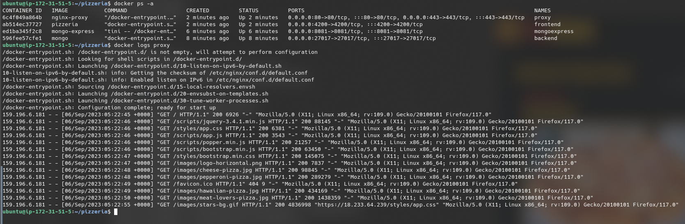

#### Pizzeria (frontend) logs
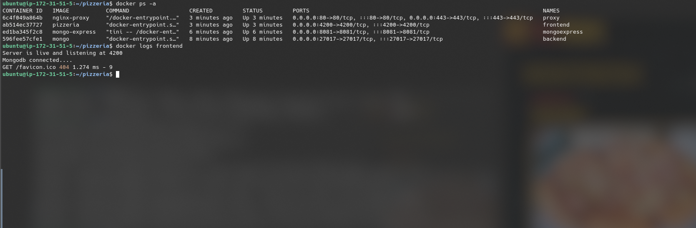

#### Mongo Express logs
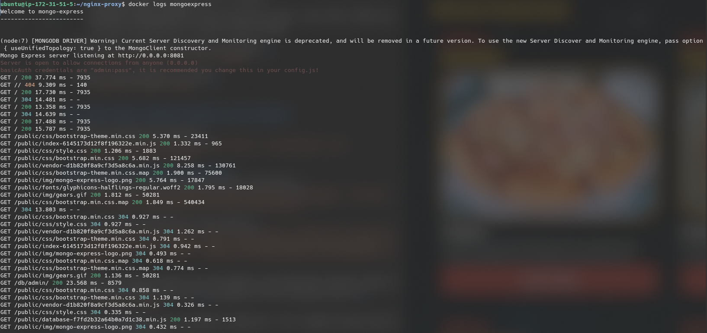

#### MongoDB (backend) logs
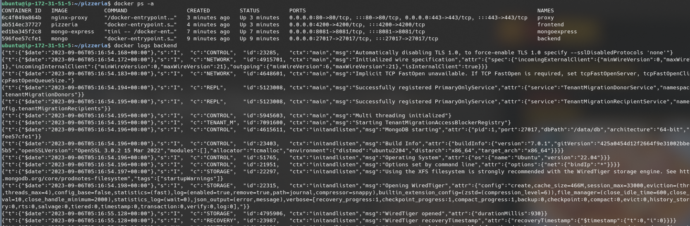

# Using the App (proof of working database)

- Initially we are not logged in.
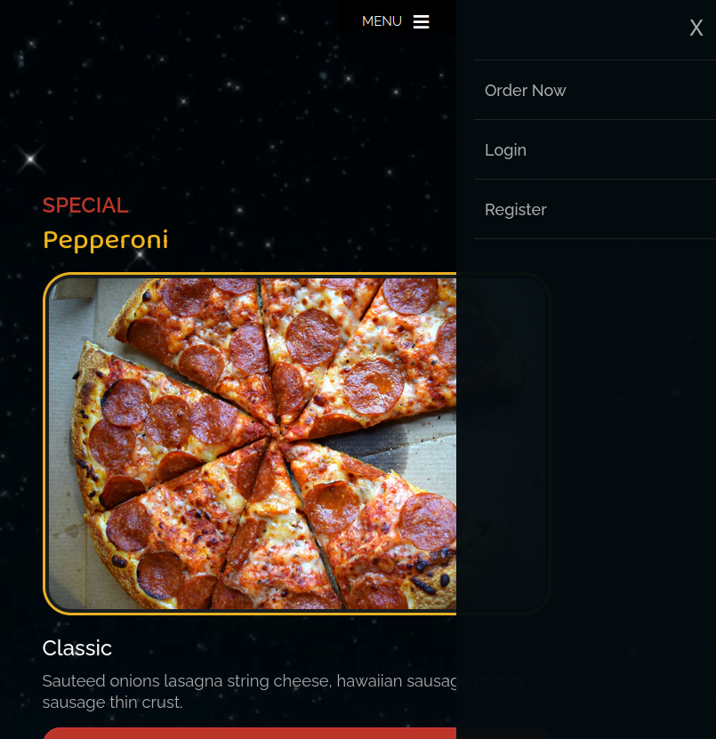

- We can register on the `Register` page.
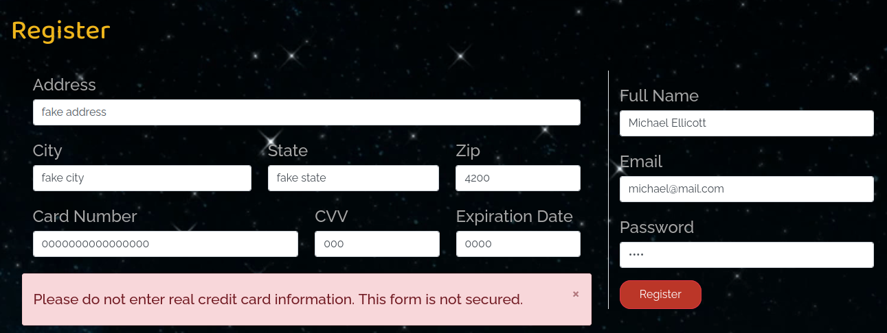

- We can then log in.

- We are now logged in.

- We can make an order.
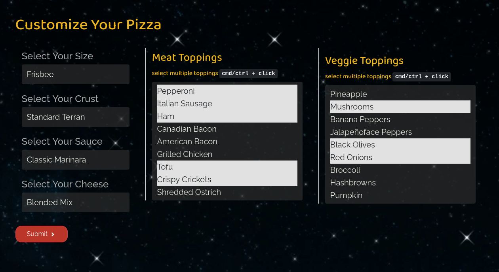

- After submitting the order, it shows on the `Orders` page.
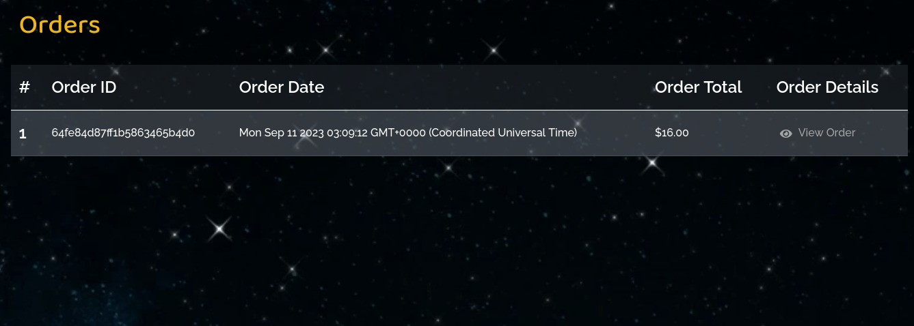

- The `Account Info` page lets the user edit their information which is stored in the database.
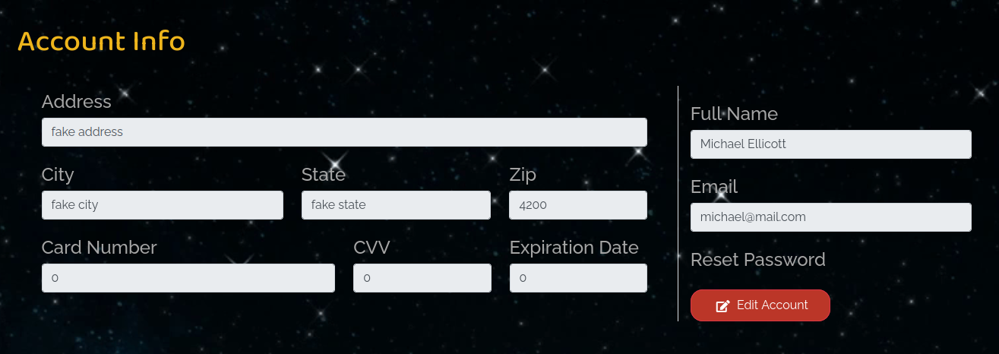

- Connect to Mongo Express by visiting the instance on port 8081. \
  There are four databases, `admin`, `config`, `local` and `test`.
  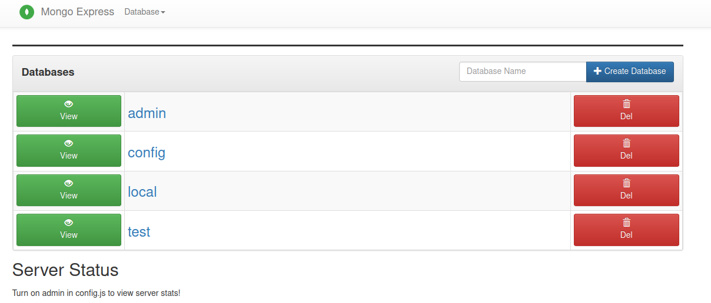

- Only the `test` database stores information for the pizzeria, the other three are there by default when using MongoDB.

- The `test` database has three collections, `orders`, `sessions` and `users`.
  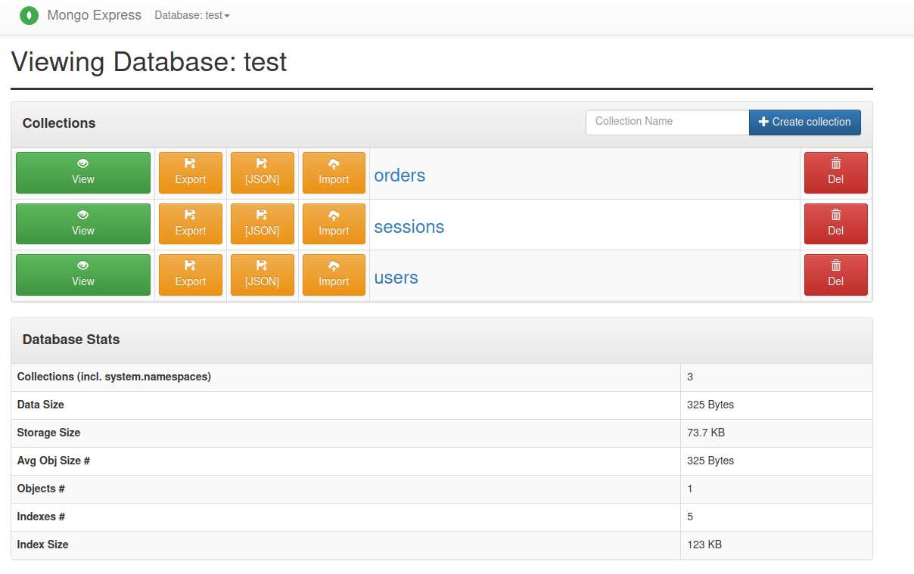

- The `orders` collection stores orders information.
  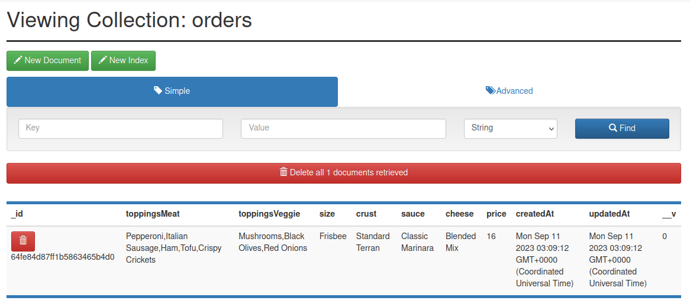

- The `users` collection stores information about registered users.
  Note that the password field is encrypted. Storing the users raw password in a database like this would be a massive security issue.
  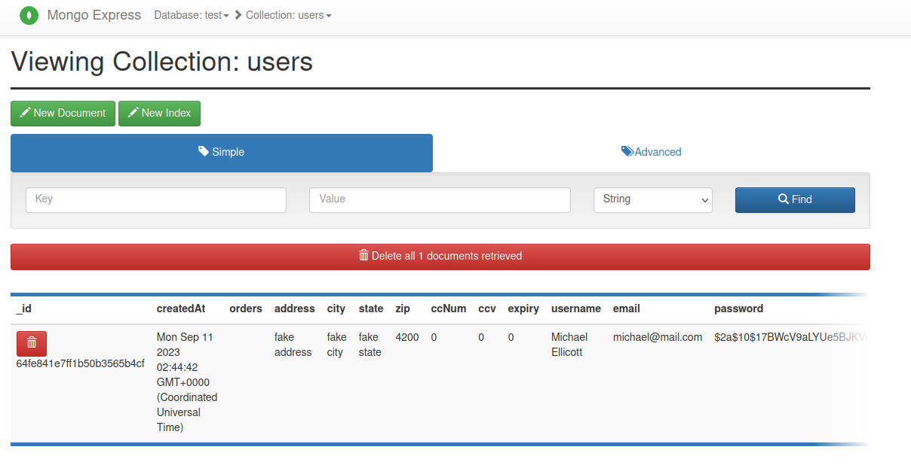

- The `sessions` collection stores browser session information for currently connected users.
  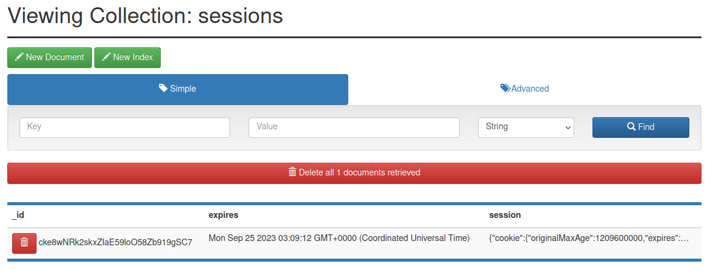

