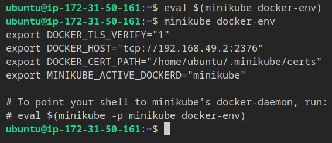
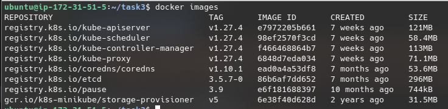
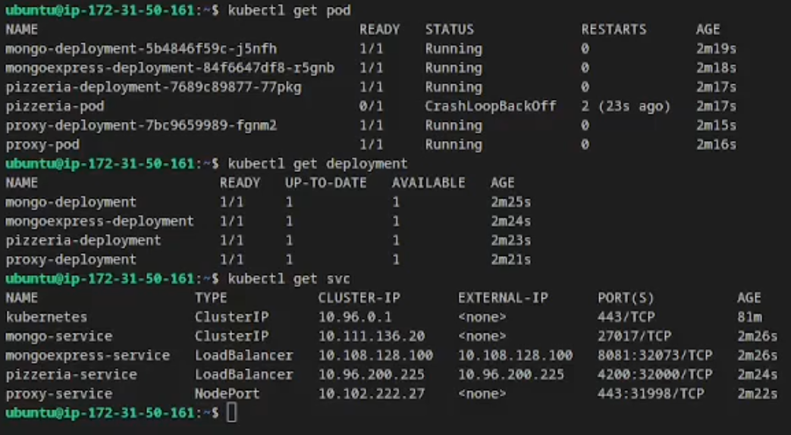
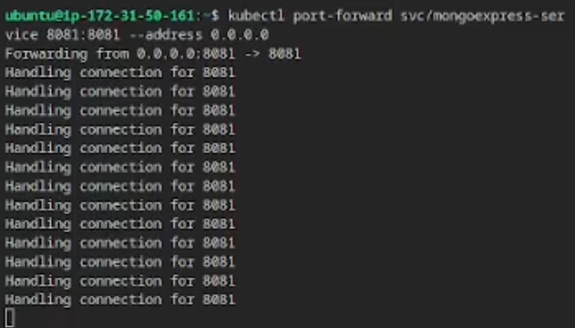

# Task 3 - Minikube and Kubectl

- Ensure instance has at least 2 CPU cores.
    - Stop the instance
    - Go to actions > instance settings > change instance type
    - Select t2.medium
    - Start the instance

## Install Minikube
- Install Minikube. \
    `$ curl -LO https://storage.googleapis.com/minikube/releases/latest/minikube-linux-amd64` \
    `$ sudo install minikube-linux-amd64 /usr/local/bin/minikube`

- Create alias for kubectl so we don't have to type `minikube kubectl --` every time we want to run a kubectl command. \
    `$ alias kubectl="minikube kubectl --"`

- Deleted downloaded file after install. \
    `$ rm -R minikube-linux-amd64`

- Start Minikube and ensure it is working. \
    `$ minikube start` \
    `$ minikube status`

## Minikube + Docker
- Configure the local environment variables to run docker inside the Minikube container. \
    `$ eval $(minikube docker-env)`

- Running `minikube docker-env` by itself will print the environment variables which are set by the previous command. \
    

- List the docker images to confirm that `eval` had an effect. \
    `$ docker images`

    

## Pizzeria (frontend)
- Make a new directory called `task3` and copy the pizzeria app into it. \
  `$ mkdir task3` \
  `$ cp task1/pizzeria task3/pizzeria` \
  `$ cd task3/pizzeria`

- Open the Dockerfile and change  `ENV MONGODB_URI="mongodb://mongo-backend:27017/"` to `ENV MONGODB_URI="mongodb://mongo-service:27017/"`.

  `mongo-backend` will be renamed to `mongo-service` in minikube for clarity.

      # Use the node docker image as a base for this image.
      FROM node:latest

      WORKDIR /usr/src/app
      COPY package*.json ./

      # Install node.js dependencies (found in package.json).
      RUN npm install

      # Copy all directory contents.
      COPY . .

      # The pizzeria app requires these environment variables to be set.
      ENV MONGODB_URI="mongodb://mongo-service:27017/"
      ENV PORT=4200
      ENV SECRET="secret"

      # Run the app on port 4200.
      EXPOSE 4200

      # Run the app with the command "node server.js".
      CMD ["node", "server.js"]

- Build the docker image. \
    `$ docker build -t frontend .`

## Nginx Proxy
- Copy the nginx-proxy directory over from task 1. \
  `$ cp task1/nginx-proxy task3/nginx-proxy` \
  `$ cd task3/nginx-proxy`

- Like with the pizzeria app, we need to make a small edit. \
  Open `nginx.conf` and change `server frontend:4200` to `server pizzeria-service:4200`.

  Like `mongo-backend`, `frontend` is also being renamed for clarity.

      # One process running.
      worker_processes 1;

      events {
          # The one process is to maintain up to 1024 connections.
          worker_connections 1024;
      }

      http {
          sendfile on;
          large_client_header_buffers 4 32k;

          upstream frontend-server {
              server pizzeria-service:4200;
          }

          server {
              listen 443 ssl;
              server_name localhost;
              ssl_certificate /etc/ssl/certs/localhost.crt;
              ssl_certificate_key /etc/ssl/private/localhost.key;

              # Redirect to the frontend container (svc/pizzeria-service in kubernetes)
              location / {
                  proxy_pass http://frontend-server/;

                  # Add timeout duration.
                  proxy_connect_timeout 5s;
                  proxy_send_timeout 5s;
                  proxy_read_timeout 5s;
                  proxy_redirect off;
                  proxy_http_version 1.1;
                  proxy_cache_bypass $http_upgrade;
                  proxy_set_header Upgrade $http_upgrade;
                  proxy_set_header Connection keep-alive;
                  proxy_set_header Host $host;
                  proxy_set_header X-Real-IP $remote_addr;
                  proxy_set_header X-Forwarded-For $proxy_add_x_forwarded_for;
                  proxy_set_header X-Forwarded-Proto $scheme;
                  proxy_set_header X-Forwarded-Host $server_name;
                  proxy_buffer_size 128k;
                  proxy_buffers 4 256k;
                  proxy_busy_buffers_size 256k;
              }
          }
      }

## Minikube
#### Create a persistent volume

If we want the data stored in the MongoDB database to persist after a Minikube stops we need to set up a persistent volume.

- Create a mongo-pvol.yml file. \
  `$ nano mongo-pvol.yml`

      apiVersion: v1
      kind: PersistentVolume
      metadata:
        name: mongodb-pv
      spec:
        capacity:
          storage: 1Gi # Allocate 1 GiB of space.
        volumeMode: Filesystem
        accessModes:
          - ReadWriteOnce
        persistentVolumeReclaimPolicy: Retain
        storageClassName: manual
        hostPath:
          path: /data/mongodb

- Create a mongo-pvolc.yml (persistent volume claim) file. \
  `$ nano mongo-pvolc.yml`

      apiVersion: v1
      kind: PersistentVolumeClaim
      metadata:
        name: mongodb-pvc
      spec:
        accessModes:
          - ReadWriteOnce
        storageClassName: manual
        resources:
          requests:
            storage: 1Gi # Claim 1 GiB of space

#### Create a deployment for MongoDB
- Create a mongo-dep.yml file. \
  `$ nano mongo-dep.yml`

      apiVersion: apps/v1
      kind: Deployment
      metadata:
        name: mongo-deployment
        labels:
          app: mongo
      spec:
        replicas: 1
        selector:
          matchLabels:
            app: mongo
        template:
          metadata:
            labels:
              app: mongo
          spec:
            containers:
            - name: backend
              image: mongo
              ports:
              - containerPort: 27017
              volumeMounts:
              - name: mongodb-data
                mountPath: /data/db

            volumes:
            - name: mongodb-data
              persistentVolumeClaim:
                claimName: mongodb-pvc # Use the claim defined in mongodb-pvc.yml

- Apply the deployment. \
  `$ kubectl apply -f mongo-dep.yml`

#### Create a service for MongoDB
- Create a mongo-svc.yml file. \
  `$ nano mongo-svc.yml`

      apiVersion: v1
      kind: Service
      metadata:
      name: mongo-service
      spec:
      selector:
          app: mongo
      ports:
          - protocol: TCP
          port: 27017
          targetPort: 27017

- Apply the service. \
  `$ kubectl apply -f mongo-svc.yml`

#### Create a deployment for Mongo Express
- Create a mongo-dep.yml file. \
  `$ nano mongoexpress-dep.yml`

      apiVersion: apps/v1
      kind: Deployment
      metadata:
      name: mongoexpress-deployment
      labels:
          app: mongoexpress
      spec:
      replicas: 1
      selector:
          matchLabels:
          app: mongoexpress
      template:
          metadata:
          labels:
              app: mongoexpress
          spec:
          containers:
          - name: mongoexpress
              image: mongo-express
              ports:
              - containerPort: 8081
              env:
              - name: ME_CONFIG_MONGODB_SERVER
              value: "mongo-service"

- Apply the deployment. \
  `$ kubectl apply -f mongoexpress-dep.yml`

#### Create a service for Mongo Express
- Create a mongoexpress-svc.yml file. \
  `$ nano mongoexpress-svc.yml`

      apiVersion: v1
      kind: Service
      metadata:
      name: mongoexpress-service
      spec:
      type: LoadBalancer
      selector:
          app: mongoexpress
      ports:
          - protocol: TCP
          port: 8081
          targetPort: 8081

- Apply the service. \
  `$ kubectl apply -f mongoexpress-svc.yml`

#### Create a pod for the Pizzeria app
Like in task 1, the pizzeria app requires some environment variables to be defined.
- Go back to the parent directory and create a pizzeria-pod.yml file. \
    `$ cd ..` \
    `$ nano pizzeria-pod.yml`

      apiVersion: v1
      kind: Pod
      metadata:
      name: pizzeria-pod
      labels:
          app: pizzeria
      spec:
      containers:
          - name: frontend
          imagePullPolicy: Never
          image: pizzeria
          env:
          - name: MONGODB_URI
              value: "mongodb://backend:27017/"
          - name: PORT
              value: "4200"
          - name: SECRET
              value: "secret"

- Create the pod. \
  `$ kubectl apply -f pizzeria-pod.yml`

- Verify the pod status. \
  `$ kubectl get pods` \
  

- Check logs to ensure nothing went wrong. \
  `$ kubectl logs pizzeria-pod` \
  

#### Create a deployment for the Pizzeria app

- Create a pizzeria-dep.yml file. \
  `$ nano pizzeria-dep.yml`

      apiVersion: apps/v1
      kind: Deployment
      metadata:
      name: pizzeria-deployment
      labels:
          app: pizzeria
      spec:
      replicas: 1
      selector:
          matchLabels:
          app: pizzeria
      template:
          metadata:
          labels:
              app: pizzeria
          spec:
          containers:
          - name: frontend
              image: pizzeria
              imagePullPolicy: Never
              ports:
              - containerPort: 4200

- Run the deployment. \
  `$ kubectl apply -f pizzeria-dep.yml`

#### Create a service for the Pizzeria app
- Create a pizzeria-svc.yml file. \
  `$ nano pizzeria-svc.yml`

      apiVersion: v1
      kind: Service
      metadata:
      name: pizzeria-service
      spec:
      type: LoadBalancer
      selector:
          app: pizzeria
      ports:
          - protocol: TCP
          port: 4200
          targetPort: 4200
          nodePort: 32000

- Apply the service. \
  `$ kubectl apply -f pizzeria-svc.yml`

#### Create a pod for the nginx proxy
- Copy the nginx-proxy from task 1 to the `task3` directory. \
  `$ cp task1/nginx-proxy task3/nginx-proxy`

- Create a proxy-pod.yml file. \
  `$ nano proxy-pod.yml`

      apiVersion: v1
      kind: Pod
      metadata:
      name: proxy-pod
      labels:
          app: proxy
      spec:
      containers:
          - name: proxy
          imagePullPolicy: Never
          image: nginx-proxy

- Apply the pod. \
  `$ kubectl apply -f proxy-pod.yml`

#### Create a deployment for the nginx proxy
- Create a proxy-dep.yml file. \
  `$ nano proxy-dep.yml`

      apiVersion: apps/v1
      kind: Deployment
      metadata:
      name: proxy-deployment
      labels:
          app: proxy
      spec:
      replicas: 1
      selector:
          matchLabels:
          app: proxy
      template:
          metadata:
          labels:
              app: proxy
          spec:
          containers:
          - name: proxy
              image: nginx-proxy
              imagePullPolicy: Never
              ports:
              - containerPort: 443

- Apply the deployment. \
  `$ kubectl apply -f proxy-dep.yml`

#### Create a service for the nginx proxy
- Create a proxy-svc.yml file. \
  `$ nano proxy-svc.yml`

        apiVersion: v1
        kind: Service
        metadata:
        name: proxy-service
        spec:
        type: NodePort
        selector:
            app: proxy
        ports:
            - name: https
            port: 443

- Apply the service. \
  `$ kubectl apply -f proxy-svc.yml`

#### Expose the App

- Run `kubectl get pod/deployment/svc` to view the statuf of all pods/deployments/services. \
  

- First, run `minikube tunnel` either on a separate ssh instance
  or in the background by running `minikube tunnel &`. \
  This is to expose the pizzeria and mongo express services to the nginx service.

- Expose the Nginx server to the internet. \
  `$ kubectl port-forward svc/proxy-service 8080:443 --address 0.0.0.0 &`
  - `svc/proxy-service` -The Service to run, in our case the nginx proxy.
  - `8080:443` -Forward the external port 8080 to internal port 443 (HTTPS). The external port is the one used to connect to the service over the internet.
  - `--address 0.0.0.0` -Specify which IP address to allow connections from. `0.0.0.0` will allow connections from any IP address.
  - `&` - An ampersand tells Linux to run the process in the background, leaving the shell available to use.

- Expose the Mongo Express server to the internet. \
  `$ kubectl port-forward svc/mongoexpress-service 8081:8081 --address 0.0.0.0 &`
  - `svc/mongoexpress-service` -The Service to run, in our case the mongo express server.
  - `8080:8081` -Forward the external port 8081 to internal port 8081 (HTTPS). The external port is the one used to connect to the service over the internet.
  - `--address 0.0.0.0` -Specify which IP address to allow connections from. `0.0.0.0` will allow connections from any IP address.
  - `&` - An ampersand tells Linux to run the process in the background, leaving the shell available to use.

- If kubectl port-forward is not run in the background, logs regarding incoming connections will be shown. \
  

 
